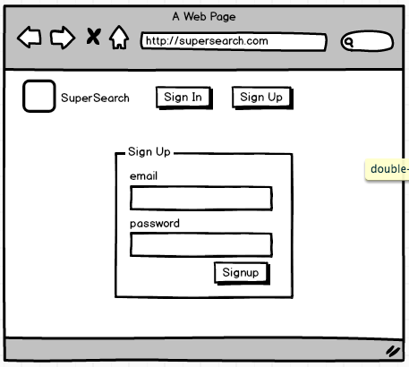

# SuperSearch Application

### Major Project for codefactory academy bootcamp

#### Clone Repository

`git clone git@github.com:alexi21/SuperSearchProjectFolder.git supersearch`

#### Install and start rethinkDB

`cd supersearch && npm install rethinkdb && rethinkdb`

#### Start server API

`cd supersearch/server && npm run dev`

#### Start frontend

`cd supersearch/frontend && npm start`

#### Open application

Navigate to localhost:8000 in your web browser

Signup and navigate away...

## The project

Build an interactive React-Redux frontend with a separate Node.JS backend API to manage RethinkDB with thinky.io as an ORM wrapper.

## Client interaction

### Demonstrate your ability to satisfy your client with the quality of your work and high level of service.

####One Record all interactions with your client in a diary format.

Email records provided to head teacher

####Two Plan information gathering activities to determine project requirements, constraints and risks.

####Client requirements constraints and risks, a discussion of the project:

  The clients application involves some IP, and as such I cannot explicitly describe the details. However, the requirements can be mocked up in a Stack Overflow style clone, with Post data and associated Comment data. Which is how I decided to build the application for this project.

  Client has two main requirements.

#####1.

The first requirement was the ability to store and parse a large database. It was decided due to the shape of the data, and the dynamic manner in which the data would be created and stored that a noSQL database should be used. Initially we discussed using MongoDB, however due to the flexibility provided by using thinky.io as an ORM wrapper for RethinkDB we decided to try using thinky.io and rethinkDB together. This pattern enabled me to create dynamic joins on database queries that allowed a great deal of flexibility in the way the documents are stored and queried.

  RethinkDB has its own query language Reql which is a powerful functional programming style query language that is compatible with functional programming patterns in javascript.

  At this point we also decided that the server should be built in javascript using node.js as the client was concerned with the possibility of scale, and to allow a more seamless interaction with the noSQL database that we would choose. Whether that be MongoDB or RethinkDB.

  This led to some useful functional programming on the backend, and a simplicity overall in the design of the API.

  For eg. the Data model is a flat document that grows through a join query to include an array of associated documents. with the following pattern:

  `Data.get(dataId).getJoin().run()
    .then(function(data) {
      res.json(data);
    })`

  Made possible using the thinky.io ORM pattern:

  `Data.hasMany(DataComment, 'comments', 'id', 'postId');`

  Of course storing the associated comment with the correct information to allow that join does involve an additional layer of complexity, however because the `id` of the data is passed to the API when a associated data 'comment' is created, that id is simply saved as a property in the document.

  Similar to other SQL and noSQL patterns, RethinkDB and thinky.io provide neat solutions to consistently saving data with the requisite information such as when it is created. Unlike Rails and ActiveRecord this must be explicitly declared. For example:

  `Data.pre('save', function(next) {
    const data = this;
    data.createdAt = new Date();
    next();
  });`

  This did add complexity over similar design patterns in ROR particularly in the hashing of passwords before storage in the database, however, it does remove the abstraction and allow further refinement as requirements change. This adds risks to the project, in that patterns must be thoroughly tested before production as they have not been vetted through the community. The added power this affords in the refinement of the code as the project grows was deemed appropriate.

  The rest of the server runs on a simple node.js and express framework that has no design antipatterns.

  Passport and Bcrypt are used to hash passwords, create and provide JWTs to users, and run the logic for authentication on the server. The server itself is a fully authenticated API that requires users to signin, signup, or have the required JWT associated with their user id.

#####2.
The second requirement was that the front end should enable fast and intuitive responses to interaction. The user would be selecting, deleting, and adding search query data as the search was further refined.

This would require a frontend that could quickly react to the users interaction, and update seemlessly. Due to these requirements we narrowed the field to two possibilities. The Meteor framework, which would enable rapid prototyping and hook up quickly with a MongoDB while providing an easy way of managing webhooks.

The other possiblity was ReactJS which we settled on for two reasons. Firstly, it would not require being locked into the Meteor framework which is highly opinionated and has an idiosyncratic API. Secondly, it would be more likely that we would be able to find more developers if the project team expanded.

Once we had settled on this choice, I made the decision to build the React application using Redux. Redux provides a powerful but simple pattern for managing data in the frontend, and would enable me to pull some of the business logic off the API and into the frontend. Allowing me to call the API less often, and narrow the terms required to streamline the API calls within the frontend itself.

####Three Develop project charter, including preliminary statement of project scope and obtain sign-off

See client interaction emails.

####Four Prepare project work breakdown, schedule and budget

40 hours training
40 hour sprint for first iteration
40 hour sprint for second iteration

Cost $0

####Five Compile project management plan documents as necessary to communicate the intended management strategy for the project and obtain sign-off

See client interaction emails

####Six Identify and select team members, and allocate roles and responsibilities, based on project solution requirements

Lead developer: me
Second developer: me
UI/UX developer: me
Gopher: me

####Seven Determine training and support needs of team members

In order to prepare for this project I completed the following courses on Udemy:

Modern React with Redux
Advanced React and Redux
ES6 javascript: The complete developers guide

####Eight Establish project team values and agreed behavioural standards with team members

Agreed behavioural standards:

I was influenced by the Atlassian code and follow their lead.

Honesty without bullshit
Play as a team and always support one another
Don't *&^^*& the customer
Be the change you seek
Show compassion and kindness at all times
Discrimination or bias because of gender, race, or sexual preference is never tolerated.

####Nine Monitor delivery and acceptance of assigned project team work activities and manage individuals

Log of all project commits:

Wed Aug 3 21:59:15 2016 +1000
    Add readme

Tue Aug 2 12:58:39 2016 +1000
    Instant search of comments in store using string comparison

Tue Aug 2 00:28:05 2016 +1000
    Add search bar to comments list

Mon Aug 1 08:18:43 2016 +1000
    refactor comment list into its own component

Sun Jul 31 17:06:18 2016 +1000
    create mounting logic in user profiles to manage state, now to push it to reducers!

Sun Jul 31 01:38:18 2016 +1000
    update both current user profile and other users profile to include their posts. Problem with shared STATE between users that needs to be fixed.

Sat Jul 30 22:23:05 2016 +1000
    Write more action creator tests

Sat Jul 30 21:28:59 2016 +1000
    Write action creator tests

Sat Jul 30 20:24:49 2016 +1000
    initial commit

Sat Jul 30 12:23:01 2016 +1000
    first tests, need to fix problem with getting local storage

Fri Jul 29 21:45:54 2016 +1000
    some bug fixes, use compose to run thunk in redux

Fri Jul 29 17:48:19 2016 +1000
    Begin writing tests

Fri Jul 29 17:05:07 2016 +1000
    finish component to render user profiles of other users. create logic in api to serve those users to client

Fri Jul 29 12:50:54 2016 +1000
    wip

Fri Jul 29 00:01:19 2016 +1000
    Create help page, fix some bugs in TinyMCE

Thu Jul 28 20:23:00 2016 +1000
    Update data to allow data editing using TinyMCE

Thu Jul 28 19:51:55 2016 +1000
    Incorporate TinyMCE into user profile to allow markup inside the user bio.

Thu Jul 28 18:06:31 2016 +1000
    Fix bug in user profile update.

Thu Jul 28 15:42:45 2016 +1000
    Prevent user from voting more than once on a post

Thu Jul 28 15:32:32 2016 +1000
    Prevent user from voting more than once on a post

Thu Jul 28 15:21:26 2016 +1000
    Prevent user from voting more than once on a post

Thu Jul 28 15:05:11 2016 +1000
    Add sparkline charts to show daily, weekly, monthly and all time voting patterns

Thu Jul 28 12:07:11 2016 +1000
    update votes to save createdAt, upVote true||false and userId of voter. Display number of votes in component.

Wed Jul 27 23:40:58 2016 +1000
    finish edit bio component, tie in to action creator and reducer, create api action to save updated bio.

Wed Jul 27 23:02:16 2016 +1000
    edit bio component

Wed Jul 27 22:32:10 2016 +1000
    wip

Wed Jul 27 21:33:34 2016 +1000
    fix profile and allow submission of all user details in user signup

Wed Jul 27 21:06:32 2016 +1000
    Add user profile card

Wed Jul 27 20:56:58 2016 +1000
    Create user profile page, and api look up. Add firstname, lastname, bio, imageurl, to erd User

Wed Jul 27 18:52:22 2016 +1000
    Add toasts

Wed Jul 27 17:40:48 2016 +1000
    minor changes to edit post

Wed Jul 27 17:25:24 2016 +1000
    wip

Wed Jul 27 15:29:01 2016 +1000
    Create edit data component, submit to the api and receive the updated data, show updated data in the component. Toggle edit data component show/hide inside the show data component.

Wed Jul 27 11:17:20 2016 +1000
    Style show_data component

Wed Jul 27 00:50:32 2016 +1000
    upvotes and downvotes for posts with styling

Tue Jul 26 19:53:17 2016 +1000
    have welcome component display most recent comments

Tue Jul 26 18:17:34 2016 +1000
    client side image upload and response url for db save :)

Tue Jul 26 15:09:40 2016 +1000
    add image url submission and display on submit

Tue Jul 26 12:57:31 2016 +1000
    add date and user name to comments

Mon Jul 25 22:16:21 2016 +1000
    add dates and format to look nice and with the right timezone using moment-timezone

Mon Jul 25 14:12:06 2016 +1000
    delete comments working, form reset working

Mon Jul 25 13:21:40 2016 +1000
    working out how to update nested array on immutable object

Mon Jul 25 00:42:08 2016 +1000
    API fixed :)

Sun Jul 24 23:48:10 2016 +1000
    its the API doing the wierd stuff!!!

Sun Jul 24 22:41:33 2016 +1000
    update comments working then broke when using reduxForm

Sun Jul 24 20:03:20 2016 +1000
    post with comments display

Sun Jul 24 15:33:49 2016 +1000
    get comments and save comment on API

Sun Jul 24 15:15:23 2016 +1000
    post hasMany comments

Sun Jul 24 12:33:01 2016 +1000
    comment belongsTo post

Sun Jul 24 12:19:30 2016 +1000
    start building join table to data

Sun Jul 24 01:11:48 2016 +1000
    Fix really silly bug...

Sun Jul 24 00:32:08 2016 +1000
    Woot! Immutably update state to remove objects from state.message array on delete message api call

Sat Jul 23 22:58:51 2016 +1000
    delete item is working but render after function call
    bundle.js:32576
    Uncaught (in promise)
    TypeError: this.props.message.map is not a function
    at SearchResultList.listResults

Sat Jul 23 20:21:57 2016 +1000
    add deleteItem to frontend, begin build new component

Sat Jul 23 19:42:16 2016 +1000
    delete data api on server using thinky and reql

Sat Jul 23 18:58:49 2016 +1000
    wip

Sat Jul 23 14:55:45 2016 +1000
    no more returning arrays in finding users - yay :) - using reql .get

Sat Jul 23 14:47:53 2016 +1000
    begin restyle - power outage so no bootstrap :(

Sat Jul 23 14:35:13 2016 +1000
    add title to serverapi and frontend implementation of submission, search and display

Sat Jul 23 14:22:34 2016 +1000
    convert comment to post in db implementation

Sat Jul 23 11:35:42 2016 +1000
    improve search component

Sat Jul 23 11:03:47 2016 +1000
    fix bug in comment save on server

Fri Jul 22 23:44:13 2016 +1000
    wip

Fri Jul 22 21:27:28 2016 +1000
    ensure user exists before comparing password

Fri Jul 22 21:19:03 2016 +1000
    refactor results of user lookup in signin, remove pesky array

Fri Jul 22 21:13:21 2016 +1000
    prevent user email duplication

Fri Jul 22 20:09:52 2016 +1000
    merge master

Fri Jul 22 20:08:54 2016 +1000
    merge

Fri Jul 22 20:06:00 2016 +1000
    merging

Fri Jul 22 20:02:38 2016 +1000
    bug fixed, but not happy with fix, using array indexing when returning user

Fri Jul 22 19:34:30 2016 +1000
    refactor done now fixing bugs! (can't set headers after they are sent)

Fri Jul 22 18:49:59 2016 +1000
    begin refactor

Fri Jul 22 17:23:13 2016 +1000
    clear error on component unmount on signin component

Fri Jul 22 17:01:29 2016 +1000
    save user email in comment on server from token passed from frontend

Fri Jul 22 16:22:03 2016 +1000
    create frontend comment submission

Fri Jul 22 14:50:21 2016 +1000
    thinky and reql to search comment field :)

Fri Jul 22 00:14:55 2016 +1000
    refactor rethink calls

Thu Jul 21 16:22:41 2016 +1000
    Use thinky.io and rethinkdb for data db

Wed Jul 20 22:11:18 2016 +1000
    style search results

Wed Jul 20 21:25:16 2016 +1000
    create reduxForm to handle search type and terms, on submit make api call

Wed Jul 20 21:07:01 2016 +1000
    dynamic api calls from search

Wed Jul 20 20:49:30 2016 +1000
    wip

Wed Jul 20 18:05:36 2016 +1000
    Create hook to serverAPI on frontEndApp, serve api response to page

Wed Jul 20 14:39:00 2016 +1000
    Add search types with email search and comment regex search through mongoose

Wed Jul 20 10:35:18 2016 +1000
    create database for comments, create api for setting and getting data, require jwt

Tue Jul 19 21:22:37 2016 +1000
    add search data model and methods'

Tue Jul 19 21:01:11 2016 +1000
    initial commit

####Ten Monitor and control project scope changes, risks and issues

The only major issue of note is the cost associated with hosting rethinkDB. Unfortunately heroku is not compatible with rethinkDB and in order to host the app I would have to spend money on a subscription. I have sought costing, and the initial monthly outlay would be $20, though further costs would be substantially less depending on the application usage. I am currently investigating alternatives, or the possibility of self-funding in order to create an online version of the application. In lieu of that I would refactor the code to use MongoDB and mongoose, which would involve about 3-6 hours of work.

####Eleven Manage system testing and hand over activities

Test have been written for all the action creators in the front end. The can be tested by running

`npm run test:watch`

from within the frontend/ directory.

####Twelve Prepare IT support plans and maintenance or support documents

This project is ongoing, and I intend to pivot this into a personal project. As such IT support will be provided by myself in the medium term.

####Thirteen Obtain final project sign-off

See client emails

####Fourteen Conduct post project review

TBA

####Fifteen Create a questionnaire for the client to ascertain the satisfaction with your product and service.

TBA

### Application Design

#### Demonstrate your ability to break down the problem and design a solution.

1. One page summary of your application including problem definition, solution.

Problem: Provide a functional model of an application that interacts with a document database capable of scale, whilst also allowing the power of Object Relational Mapping. Front end must be capable of holding business logic for parsing and updating data in order to minimise API stress.

2. Determine the appropriate client technology, development tools, and platform for writing the UI

See above.

3. Review the conceptual design with the client, and edit as required

See above.

4. A workflow diagram of the user journey/s.

5. Wireframes for at least 5 screens.

6. User stories for the whole application.
7. Entity Relationship Diagram (ERD).
8. Project plan and effort estimation.
9. Tools and methodologies

  - Trello or similar project management tool to be used to track progress of build.

  - Show evidence of Slack conversations or use of other communication tools.

  - Code review. Demonstrate that you have had your code reviewed by other students and that you have provided a code review for others.

  - Github. Demonstrate use of frequent commits, pull requests, documentation.

  - Use Agile development methodologies.

  - Provide evidence you have used code quality tools
